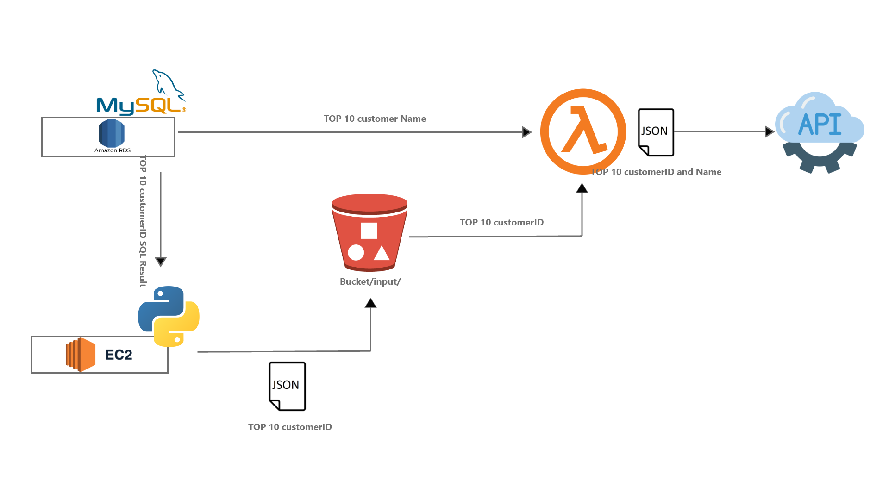

# AWS Lambda Project
This mini project is done as part of the WeCloudData Data engineering bootcamp. The purpose of the project is to get exposure to serverless computing services such as AWS Lambda in order to run event-driven functions.

## Project Architecture

## Project Scripts
- "init.sh" is used to initiate the virtual envrironment and install packages
- "requirements.txt" includes packages required for the virtual environment
- "run.py" script is used to fetch customerIDs from MySQL
- "run.sh" is used to run the python script
- "lambda_layer.sh" is used to run tasks related to creating the layer (e.g. installing and publishing the packages used in AWS lambda)
- Files under "lambda-layer" are the files used in AWS Lambda:
  - Files under "lambda-layer/lambda-script" (Lambda script and configurations)
  - "requirements.txt" includes libraries used for the layer

Note: .env files are missing from the repo and must be created for secret information
